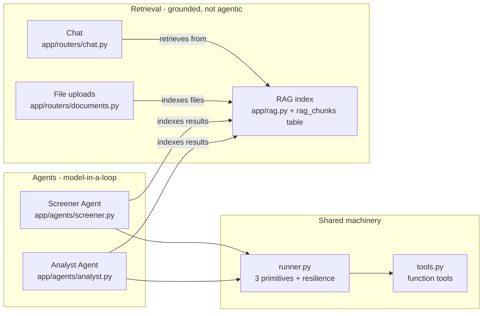
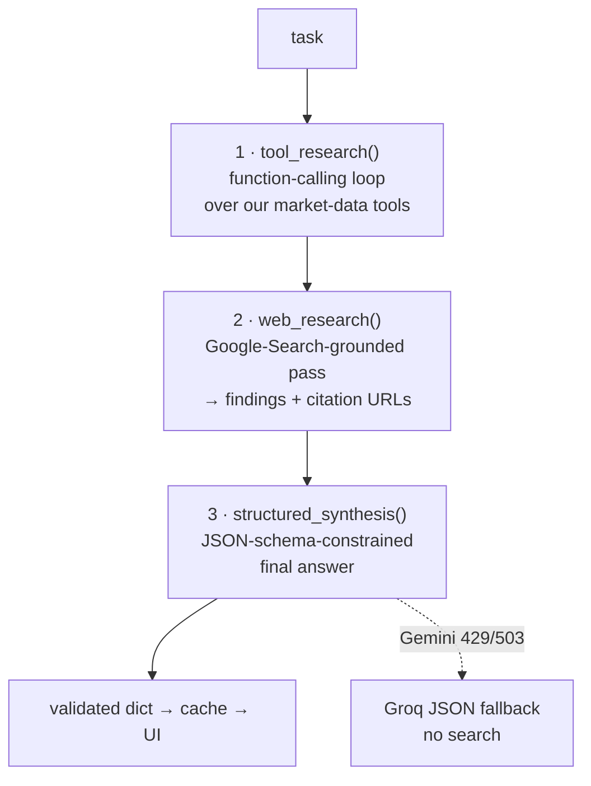
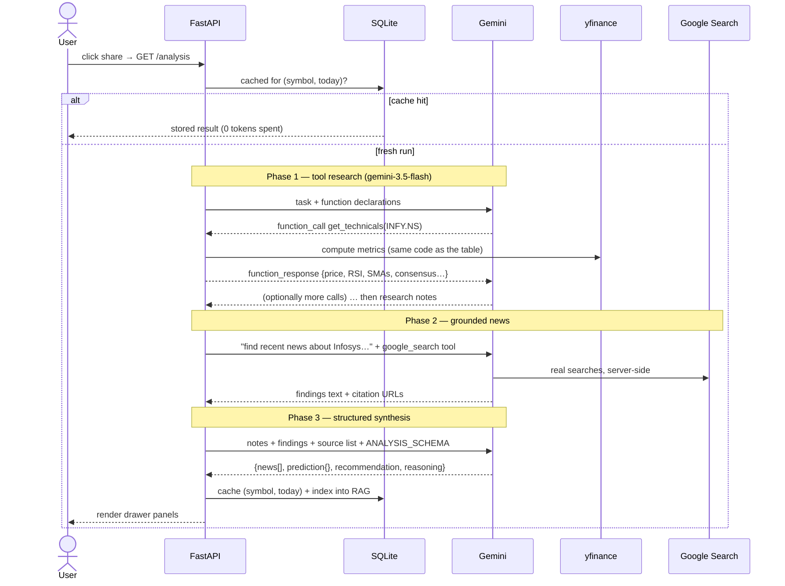

# The Agentic AI Design — a complete, part-by-part explanation

This document explains every piece of the AI system inside the Stock Portfolio
Adviser: what runs, in what order, why it is shaped the way it is, and why each
technology was chosen. It reflects the code as actually shipped (see file
references throughout), including lessons learned from live testing.

Companion docs: [DESIGN.md](DESIGN.md) (whole-system view) and
[DESIGN_ANALYSIS.md](DESIGN_ANALYSIS.md) (decision log for the non-AI parts).

---

## 1. What "agentic" means here

A plain LLM call is *one shot*: you paste data into a prompt, the model answers
from what you gave it plus its (stale) training data.

An **agent** is a model in a **loop with tools**: it can decide *for itself*
what to look up, call a tool, read the result, and call another — until it has
what it needs to answer. The intelligence is not just in the final answer but in
the *research behavior*.

In this app, "the model can look things up" means three concrete abilities:

| Ability | Mechanism | Example |
|---|---|---|
| Fetch our market data | **Function calling** — the model emits a structured call like `get_technicals(symbol="INFY.NS")`; our Python executes it and returns JSON | "What's the RSI right now?" |
| Search the live web | **Google Search grounding** — Google runs real searches server-side and hands the model results *with citation URLs* | "Any news on Infosys this month?" |
| Answer in a fixed shape | **Structured outputs** — the reply is constrained to a JSON schema so the UI renders typed fields, never free prose | `{"recommendation": "HOLD", ...}` |

Everything else in this document is about how those three abilities are wired
together, and around what constraints.

---

## 2. The cast: what AI components exist



| Component | Kind | Trigger | Model |
|---|---|---|---|
| **Analyst Agent** | Full agent (3-phase pipeline) | User opens a stock / "Refresh AI analysis" | `gemini-3.5-flash` |
| **Screener Agent** | Hybrid: code pre-screen + one model call | Top-20 table / "Refresh picks" | `gemini-3.5-flash-lite` |
| **Research chat** | RAG (retrieve-then-answer, no tools) | Every chat message (typed or voice) | `gemini-3.5-flash-lite`, Groq fallback |
| **RAG index** | Embedding store | Fed automatically by every agent run + file uploads | `gemini-embedding-001` |

A deliberate design rule runs through all of it: **arithmetic in code, judgment
in the model.** Anything deterministic (returns, SMAs, RSI, screening scores,
status colors) is computed in Python for free in milliseconds; the model is
spent only where actual judgment is needed.

---

## 3. Why this provider stack (the honest history)

The AI provider changed twice. Each switch was forced by a practical
constraint, and each taught something about the design:

| # | Provider | Why chosen | Why left |
|---|---|---|---|
| 1 | Anthropic Claude (tool runner) | Original plan; first-class agent tooling | No API credentials available |
| 2 | OpenAI Responses API (`gpt-5` / `gpt-5-mini`) | User supplied an OpenAI key; built-in `web_search` | The account had zero credits (`insufficient_quota`) |
| 3 | **Google Gemini free tier + Groq fallback** ✅ | The requirement became "free for longer" | — current |

**Why Gemini won the free-tier comparison.** The Analyst Agent needs four
things at once: function calling, *live web search*, JSON-schema output, and
embeddings for RAG. As of mid-2026, Gemini's free tier is the **only** one that
provides all four — Groq and OpenRouter's free models have no web search, and
local models (Ollama) have neither search nor reliable structured output.
Search is the non-negotiable: without it, "news + prediction" degrades into
hallucinated headlines from training data.

**Why Groq as the fallback lane.** Groq's free tier is an *independent quota*
on different infrastructure (fast Llama 3.3 70B via an OpenAI-compatible API —
so the existing `openai` Python package drives it with just a `base_url`
change; zero new dependencies). When Gemini rate-limits, chat and screener
synthesis retry there transparently. Groq cannot search, so the analyst's news
phase never falls back — a wrong-but-confident news digest would be worse than
an honest "news unavailable."

**The architectural payoff of two migrations:** every provider swap touched
only `agents/runner.py` + the tool-declaration glue. Prompts, JSON schemas,
caching, endpoints, and UI survived unchanged. Keeping *all* provider-specific
code behind one module is the single most load-bearing decision in this design.

### Model selection, with reasoning

| Model | Used for | Reasoning |
|---|---|---|
| `gemini-3.5-flash` | Analyst | The strongest *stable* free-tier model that supports search grounding. Deep per-stock research is the output the user acts on — it gets the best model. Runs at most once per stock per day (cached), so its tighter quota is fine. |
| `gemini-3.5-flash-lite` | Screener + chat | These tasks are mechanical (ranking pre-scored rows) or conversational (RAG answers) — lite quality suffices, and its larger daily quota absorbs chat traffic. On a free stack, model choice is **quota allocation**, not just cost. |
| `gemini-3.6-flash` | Emergency fallback | Gemini free-tier limits are **per model**. A different model id is a different quota bucket — hopping models rides out a 429 without waiting. |
| `gemini-embedding-001` | RAG embeddings | Free at ~10M tokens/min; 3072-dim vectors. |
| Groq `llama-3.3-70b-versatile` | Cross-provider fallback | Independent free quota, very fast, good JSON mode. |

Every model is overridable via env (`ANALYST_MODEL`, `SCREENER_MODEL`,
`CHAT_MODEL`, `GEMINI_FALLBACK_MODEL`, `GROQ_MODEL`) — model names churn (see
§9), so they were never hard-coded deep in logic.

---

## 4. The engine room: three primitives in `runner.py`

The ideal agent is one loop where the model freely mixes our function tools,
web search, and schema-constrained output. **Gemini's API forbids that mix** —
a single request may use Google-Search grounding, *or* custom function tools,
*or* a strict response schema, but not all together. Rather than fight it, the
runner exposes the loop as three composable primitives, and agents chain them:



This turned out to be a *virtue*, not just a workaround: each phase has one
job, one failure mode, and one kind of output, which made the quota-degradation
story (§8) clean.

### 4.1 `tool_research()` — the function-calling loop

The genuinely "agentic" part. Mechanics, step by step:

1. We send the task + a **function declaration** for each tool (name,
   description, JSON-schema parameters — defined in `tools.py`). The
   description is the model's only manual for the tool, so it states *when* to
   call it, not just what it does.
2. The model replies either with text (done) or with one or more
   **`function_call` parts**: `{name: "get_technicals", args: {symbol:
   "INFY.NS"}}`. It chose that call itself — nothing in our code decides which
   tool runs when.
3. Our loop executes the matching Python function (`TOOL_IMPLS[name](**args)`)
   and appends a **`function_response` part** with the JSON result to the
   conversation. Tool *errors* are also returned as JSON (`{"error": ...}`)
   rather than raised — the model can read the error and adapt (retry with a
   fixed symbol, use a different tool).
4. Repeat until the model answers in text, or a **hard cap of 8 turns** hits —
   the runaway-loop guard every agent needs.

The two tools are thin wrappers over the same `market_data.py` module the
dashboard table uses — so the agent can never see different numbers than the
UI. `get_price_history` additionally **thins its output to ≤ ~60 points**:
tool results are prompt tokens, and a 1,250-row price series would waste
context the model doesn't need.

### 4.2 `web_research()` — grounded search

One call with the `google_search` tool enabled. Google executes real searches
server-side and the response carries **`grounding_metadata`**: the chunks of
web content used, each with a URI and title. We harvest those into a
`[{title, url}]` source list. Two reasons this beats the alternatives:

- *vs. scraping Google News RSS*: no fragile parsing, relevance filtering is
  done by the model, and we get resolvable citation URLs for the UI.
- *vs. asking the model "what's the news"*: without grounding the model would
  fabricate plausible headlines from training data. With grounding, every news
  item in the final output maps to a real fetched source.

### 4.3 `structured_synthesis()` — schema-constrained answers

The final phase passes `response_json_schema` so the reply **must** parse into
our shape (e.g. `ANALYSIS_SCHEMA`: news array, prediction with enum confidence,
BUY/HOLD/SELL enum, reasoning). Why this matters: the frontend renders typed
fields — badges, panels, link lists. Free prose would need brittle parsing and
would drift. Enums (`"BUY" | "HOLD" | "SELL"`) also stop the model from
inventing a fourth category.

Defense in depth: even schema-constrained replies pass through
`_extract_json()`, which tolerates code fences and wrapping text — needed
mainly for the Groq fallback path, where schema enforcement is weaker (schema
is embedded in the prompt + Groq's `json_object` mode).

### 4.4 `_generate()` — the resilience layer under everything

Every Gemini call in every primitive goes through one gate that encodes what
live testing taught about the free tier:

```
attempt 1: primary model,   immediately
attempt 2: fallback model,  +2s     ← different model = different quota bucket
attempt 3: primary model,   +40s    ← per-minute window has reset
attempt 4: fallback model,  +10s
```

Retried errors: HTTP 429 (rate/quota) and 500/503/"high demand"/"overloaded"
(capacity). **Not** retried: 401/403 (a bad key never fixes itself) and 404
(wrong model id) — those surface immediately.

Above `_generate`, a second, *cross-provider* fallback: `structured_synthesis`
and the chat's `simple_response` catch a still-failing Gemini and retry on
**Groq**. The analyst's synthesis deliberately opts out (`groq_fallback=False`)
so one analysis is never a Franken-run of two providers' behavior.

Finally, every failure is mapped to an `AgentUnavailable` exception with a
**human sentence** ("Gemini free-tier limit reached — try again in a minute…",
"…create a free key at aistudio.google.com/apikey"), which routers turn into an
HTTP 503 the UI shows verbatim. The user always learns *what to do*, never a
stack trace.

---

## 5. The Analyst Agent, end to end

What actually happens when you click a share (code: `analyst.py`, route:
`GET /api/stocks/{symbol}/analysis`):



Design details worth noticing:

- **Two different system prompts.** Phase 1's prompt explicitly says *"notes
  only — no recommendation yet"*; phase 3's says how to use the material
  (map news only to provided sources, empty string for unknown URLs — never
  invent, weigh technicals + consensus + news, state drivers and risks, not
  just a direction). Separating "gather" from "judge" reduces the model
  anchoring on a premature conclusion.
- **Anti-hallucination contract on news**: phase 3 may only emit news items
  drawn from phase 2's findings, with URLs from the harvested citation list.
- **Graceful news degradation**: the free search-grounding quota is separate
  and small (§9). If phase 2 throws, the run does *not* fail — phase 3 is told
  news is unavailable and returns an empty news list with a technicals-only
  analysis. A real example from live testing: INFY → HOLD, medium confidence,
  reasoning citing RSI 69.8 near-overbought and the 29% gap below the 52-week
  high — genuinely useful without news.
- **Every result feeds the chat**: after caching, the run is flattened to text
  and indexed into the RAG store (§7) — the agent's work compounds.

Cost profile: one run ≈ 3–6 Gemini requests, once per stock per day at most
(cache key `(symbol, date)`; "Refresh AI analysis" forces a rerun).

---

## 6. The Screener Agent: hybrid by design

Producing the top-20 table could have been "ask the model to screen the
market" — ~110 stocks × tool calls per stock, per refresh. Instead
(`screener.py`):

1. **Deterministic pre-screen (free, ~2s).** One *batched* yfinance download
   for the ~110-name universe (`nifty100.json`), then a plain-Python score per
   stock: `1-month return + (1-year return ÷ 6) + 10-point bonus if price >
   SMA50 > SMA200`. Top 30 survive, carrying all their metrics.
2. **One model call.** The 30 candidates — metrics inlined in the prompt — go
   to `gemini-3.5-flash-lite` with `PICKS_SCHEMA`, which forces exactly the
   table shape (rank, symbol, BUY/HOLD enum, one-sentence rationale, market
   note). The prompt requires each rationale to name a *concrete metric* — that
   is why every "Why" cell in the UI cites numbers.
3. **Groq fallback allowed** here (unlike the analyst): ranking pre-computed
   numbers needs no search, so a Llama-ranked table is a fine degraded mode.

The judgment the model adds over the raw score: penalizing overheated RSI,
distinguishing "momentum with room to run" from "chasing a 52-week high" —
things a linear formula scores identically. Cached per day (`ai_picks` table).

This is the clearest instance of the design rule: the model never computes a
return or an SMA; code never ranks judgment calls.

---

## 7. The chat: RAG over the agents' own research

The chat answers questions like *"should I hold Infosys?"* — grounded, cheap,
and instant. It is deliberately **not** an agent:

| Option considered | Why not |
|---|---|
| Chat *is* an agent (runs analyst live per question) | Minutes of latency + a fresh quota spend per message |
| Stuff all research into every prompt | Grows unboundedly as the corpus grows |
| **RAG** ✅ | Answers in ~2s from work already done and cached |

### Vector RAG — without a vector database

A frequent question: *is this vector-based or vector-less, and which database
was chosen?* The precise answer has three layers:

1. **It is real vector RAG.** Every chunk carries a genuine 3072-dimension
   embedding from `gemini-embedding-001`, and retrieval ranks chunks by
   **cosine similarity** against the embedded question.
2. **But there is no vector database.** The store is plain **SQLite** — the
   same `adviser.db` file as the watchlist. Each chunk is a row in
   `rag_chunks`; the vector is a JSON array in a text column; the similarity
   math runs **in-process with numpy** inside `rag.search()`.
3. **And there is a vector-less fallback.** When embeddings can't be produced
   (quota outage), retrieval degrades to keyword-overlap scoring over the same
   rows — degraded relevance beats a dead chat.

**Why SQLite + numpy instead of Chroma / Qdrant / pgvector / FAISS?** Scale
honesty. The corpus is one chunk per analysis, one per screener run, and ≤60
per uploaded file — a few hundred vectors at most. Brute-force cosine over a
few hundred 3072-dim vectors is sub-millisecond; a vector database would add a
service to install, run, back up, and keep consistent, and would buy nothing
until roughly 100k+ chunks. It would also break the project's "zero-setup, one
SQLite file" storage decision. The escape hatch is deliberate: all retrieval
goes through `rag.search()`, whose interface already looks like a vector
store's — swapping the internals touches nothing else.

### The life of an uploaded file

What happens, step by step, when you attach a file via 📎
(`routers/documents.py` → `rag.py`):

1. **Upload** — `POST /api/documents` (JWT-protected). Limits: 8 MB, filename
   sanitized, types `.pdf .txt .md .csv .json .log`.
2. **Text extraction** — PDFs via `pypdf` (per-page `extract_text`, pages
   joined with blank lines); text formats via UTF-8 decode. No OCR: a
   scanned-image PDF has no extractable text and is rejected with a clear
   error rather than silently indexing nothing.
3. **Chunking** (`_chunk_text`) — split on blank-line **paragraph
   boundaries**, then greedily pack paragraphs into ~**1,400-character**
   chunks (~350 tokens); an oversized single paragraph is hard-split; hard cap
   **60 chunks per file**. Why 1,400: large enough that a chunk is a coherent,
   self-contained thought; small enough that the five retrieved chunks cost
   only ~1,750 prompt tokens. Packing whole paragraphs is also why there is no
   sliding-window overlap — chunks rarely cut a thought mid-sentence.
4. **Embedding** — all chunks go to `gemini-embedding-001` in one batch call →
   one 3072-dim vector each. On failure, chunks are stored with a NULL
   embedding and remain findable via the keyword fallback.
5. **Storage** — one row per chunk: `doc_key = file:my_strategy.md#0`, the
   upload date, the text **prefixed with `[From uploaded file '…']`** so the
   model can cite provenance, and the JSON vector. Re-uploading the same
   filename deletes the old rows first — replace, never duplicate. 🗑 in the
   📚 list deletes all of a file's chunks.
6. **At question time** — the question is embedded, cosine-ranked against
   every chunk (a dimension guard skips vectors from a different embedding
   model), the top 5 enter the prompt, and all chunks of one file collapse
   into a single source label under the answer.

### The index (`rag.py`, `rag_chunks` table)

Three producers write into one store:

| Producer | doc_key | When |
|---|---|---|
| Analyst run | `analysis:INFY.NS:2026-08-16` | Every analysis, at cache time |
| Screener run | `picks:2026-08-16` | Every picks refresh |
| **User-uploaded files** | `file:my_strategy.md#0…n` | 📎 upload in the chat (PDF via `pypdf`, txt/md/csv/json; chunked ~1,400 chars on paragraph boundaries, ≤60 chunks/file, 8 MB cap) |

Each chunk stores its text plus a **3072-dim embedding** from
`gemini-embedding-001`. Indexing is fire-and-forget (`try/except pass`) — a
failed embedding must never break the analysis that triggered it; such chunks
are stored embedding-less and still findable via the keyword fallback.

### Retrieval

The query is embedded, and **cosine similarity is computed in-process with
numpy** over all chunks. No vector database — reasoning: the corpus is one
chunk per analysis/screener run plus a handful of files; brute force over a
few hundred vectors is sub-millisecond. A vector DB (Chroma/Qdrant/pgvector)
would be a service to install, run, and back up, purchasing nothing at this
scale. The moment this assumption breaks (say, >100k chunks), swap the storage
behind `rag.search()` — its interface already looks like a vector store's.

Two guards: a **dimension check** (chunks embedded under a different model are
skipped rather than crashing the dot product), and a **keyword-overlap
fallback** when embeddings are unavailable — degraded relevance beats a dead
chat.

### Answer assembly (`chat.py`)

```
instructions = chat rules (grounding, cite stock+date, plain text, not-financial-advice)
             + top-5 retrieved chunks
             + live watchlist snapshot (from the 10-min price cache — free)
input        = last 8 chat turns + the new question
model        = gemini-3.5-flash-lite → Groq on failure
```

The live snapshot is what lets the chat combine *stored judgment* with
*current numbers* — the live-tested example: strategy file says "accumulate IT
only below RSI 40" + snapshot says "INFY RSI 69.8" → "not a buy under your
rules." Sources returned with the reply are deduped and labeled
(`INFY.NS (2026-08-16)`, `top-20 2026-08-16`, `my_strategy.md`) and shown under
the answer, so every claim is auditable.

Voice input is intentionally **not** an AI-stack concern: the browser's Web
Speech API transcribes locally in Chrome and submits a normal chat message —
zero backend code, zero cost, no audio ever leaves the browser.

---

## 8. Cost & quota engineering (the free-tier budget)

Every AI call site, and what bounds it:

| Call site | Model | Requests per run | Bounded by |
|---|---|---|---|
| Analyst phase 1 | 3.5-flash | 1–4 (turn cap 8) | per-stock-per-day cache |
| Analyst phase 2 | 3.5-flash | 1 | search-grounding daily quota; degrades to no-news |
| Analyst phase 3 | 3.5-flash | 1 | same cache |
| Screener | 3.5-flash-lite | 1 | per-day cache |
| Chat turn | 3.5-flash-lite | 1 | user-initiated only |
| Query embedding | embedding-001 | 1 per chat msg | ~free (10M tok/min) |
| Chunk embedding | embedding-001 | 1 per indexed doc | tied to the caches above |

Structural rules that keep idle days at ~zero spend: **nothing in the
60-second polling path calls a model**; AI runs only on click; everything AI
is cached per day; the screener's expensive part (110 stocks) is free code.

The degradation ladder, worst case first-to-last:

```
Gemini primary → Gemini fallback model (other quota bucket)
             → wait 40s, retry both
             → Groq (chat/screener only)
             → cached yesterday's result (UI labels it "cached")
             → clear human error message; deterministic table always works
```

---

## 9. What live testing taught (and changed)

These are real events from bringing the stack up, each now encoded in code:

1. **"Available" ≠ callable.** `gemini-2.5-*` appear in the models list but
   return 404 *"no longer available to new users"* for accounts created after
   their retirement. Lesson: probe with a real `generate_content`, don't trust
   `models.list`. → defaults moved to the 3.5 generation.
2. **`-latest` aliases ride the newest model — and its capacity problems.**
   `gemini-flash-latest` (→3.7) returned sustained 503 "high demand" on the
   free tier. Pinned stable models beat aliases for reliability; aliases
   remain an env-var option.
3. **Free quotas are per model.** A 429 on one model does not block another —
   which is why `_generate`'s ladder hops models before it waits.
4. **Search grounding is its own (small) budget.** Plain generation kept
   working while every grounded call 429'd. That discovery produced the
   news-degradation path in the analyst — the app's most user-visible
   resilience feature.
5. **Models emit markdown unless told not to.** The chat renders plain text,
   so its rules now say so explicitly — presentation constraints belong in
   the prompt when the UI can't render markup.

---

## 10. Trust boundaries and safety

- **Keys never leave the backend.** The browser talks only to FastAPI; every
  AI endpoint sits behind the JWT gate. `GEMINI_API_KEY` / `GROQ_API_KEY` live
  in gitignored `backend/.env`.
- **Grounding over authority.** The model is never asked to "know" prices or
  news — prices come from tools, news from search citations, chat answers from
  retrieved research, and the UI links the sources.
- **Advice hygiene.** Recommendation enums, the deterministic "base advice"
  shown alongside AI advice with its own factor-by-factor logic panel, and a
  "not financial advice" disclaimer on every AI surface.
- **Free-tier privacy caveat**: Google may use free-tier API data to improve
  its products. Acceptable here (public market data + the user's own uploaded
  notes at the user's discretion); a paid tier or local model changes that
  calculus.

---

## 11. How to extend it (the seams)

- **Change any model**: env vars only (`backend/.env.example` lists them).
- **Add a tool** for the agents: implement a function in `agents/tools.py`
  returning a JSON string, add its declaration to `FUNCTION_DECLS` +
  `TOOL_IMPLS`. The analyst can use it on the next run — no other file changes.
- **Add an agent**: compose the three runner primitives with your own prompts
  and schema (the screener shows the minimal shape: one
  `structured_synthesis` call).
- **Swap the AI provider (again)**: reimplement the four functions in
  `runner.py` (`tool_research`, `web_research`, `structured_synthesis`,
  `simple_response`) — history shows nothing else needs to change.
- **Scale RAG**: replace the numpy scan inside `rag.search()` with a vector
  store; producers and the chat won't notice.

---

## 12. Evaluating the RAG, and reading the system's metrics

"It works on the questions I tried" is not a quality bar. The system ships
with a measurement layer covering both halves of the RAG pipeline.

### The two questions evaluation must answer

| Half | Question | Failure it catches |
|---|---|---|
| **Retrieval** | Did `search()` surface the *right* chunk for this question? | Relevant research exists but never reaches the model |
| **Generation** | Is the answer faithful to the retrieved context, and does it address the question? | Hallucination; grounded-but-off-topic answers |

### The harness: `backend/eval_rag.py`

```sh
cd backend
.venv/bin/python eval_rag.py                # retrieval + judge (3 sampled answers)
.venv/bin/python eval_rag.py --no-judge     # retrieval only — no answer-generation quota spent
.venv/bin/python eval_rag.py --judge-sample 5
```

**Golden set — built from the corpus itself.** For every document in the
index the harness generates questions with a known correct source: each cached
analysis yields *"What did the research conclude about {name}?"* and *"Should
I hold or sell {name}?"* (expected: `analysis:{symbol}`), the screener run
yields a top-picks question (expected: `picks:`), and each uploaded file
yields a summary question (expected: `file:{name}`). Hand-written cases can be
added in `backend/eval_golden.json` as
`[{"question": …, "expected_prefix": …}]`. Auto-generation means the golden
set grows with the corpus and never goes stale.

**Retrieval metrics.** Each question runs through the real `rag.search()`;
the rank of the first correct chunk yields:

- **recall@5** — fraction of questions whose correct source appeared in the
  top 5 (the chunks the model actually sees);
- **MRR** (mean reciprocal rank) — averages 1/rank, so rank 1 scores 1.0 and
  rank 5 scores 0.2; it distinguishes "barely made the list" from "top hit."

**Generation metrics — LLM-as-judge.** For a sample of questions the real
chat pipeline (`answer_question()`) produces an answer; a Gemini judge then
receives the *retrieved context + question + answer* and scores, 1–5:

- **faithfulness** — is every factual claim supported by the context? (the
  hallucination detector; the judge also lists any unsupported claims);
- **relevance** — does the answer actually address the question?

The judge sees only the context the chat saw, so it measures grounding, not
the judge's own market knowledge. First live run on this corpus: recall@5
**1.0**, MRR **1.0**, faithfulness **5.0/5**, relevance **5.0/5** across 10
golden questions — expected at a 6-chunk corpus scale; the numbers become
interesting as the corpus grows and questions get harder.

Every run is stored in the `eval_runs` table, so quality has a history, not
just a latest value.

### Live metrics: `GET /api/metrics`

Every chat turn is logged to a `chat_log` row (question, provider, retrieval
mode, top similarity score, source count, latency, answer size) — recorded
best-effort so observability can never break an answer. The JWT-protected
`/api/metrics` endpoint aggregates everything:

| Block | Fields | What it tells you |
|---|---|---|
| `rag` | chunk counts by source, embedding coverage % | Corpus health; coverage < 100% means some chunks rely on keyword fallback |
| `caches` | analyses total/today, picks days, watchlist size | How much research exists and how fresh it is |
| `chat` | turns, provider breakdown, retrieval-mode breakdown, avg top similarity, avg latency, **Groq-fallback rate** | The fallback rate is the Gemini-health indicator; avg similarity trending down means questions are outrunning the corpus |
| `eval` | latest `eval_rag.py` results + timestamp | The quality numbers, wired into the API |

Raw inspection, when you want to poke the tables directly:

```sh
sqlite3 backend/adviser.db "SELECT substr(doc_key,1,instr(doc_key,':')-1) src,
  COUNT(*), SUM(embedding IS NOT NULL) embedded FROM rag_chunks GROUP BY src;"
sqlite3 backend/adviser.db "SELECT ts, provider, retrieval_mode, top_score,
  latency_ms FROM chat_log ORDER BY id DESC LIMIT 10;"
```

### What to watch over time

- **Groq-fallback rate rising** → Gemini quota pressure; consider spacing
  refreshes or a paid tier.
- **Average top similarity falling** → users ask about things the corpus
  doesn't cover; generate more analyses or upload the missing documents.
- **Faithfulness < 5** on eval runs → read the judge's `unsupported_claims`
  list — it names the exact sentences to fix with prompt or retrieval changes.

## 13. Glossary

| Term | Meaning here |
|---|---|
| **Function calling** | The model outputs a structured request to run one of *our* Python functions; we execute it and feed the result back. |
| **Grounding** | Forcing claims to trace to a verifiable source — a tool result, a search citation, or an uploaded file. |
| **Search grounding** | Gemini's built-in Google Search tool; results arrive with citation metadata. |
| **Structured output** | Constraining the model's reply to a JSON schema (`response_json_schema`). |
| **Embedding** | A vector (here 3072 numbers) encoding a text's meaning; similar meanings → nearby vectors. |
| **RAG** | Retrieval-Augmented Generation: fetch the most relevant stored texts for a query and let the model answer *from them*. |
| **Cosine similarity** | The angle-based closeness measure used to rank chunks against the query vector. |
| **Quota bucket** | A rate limit scoped to one model id on one provider — the unit our fallback ladder hops between. |
