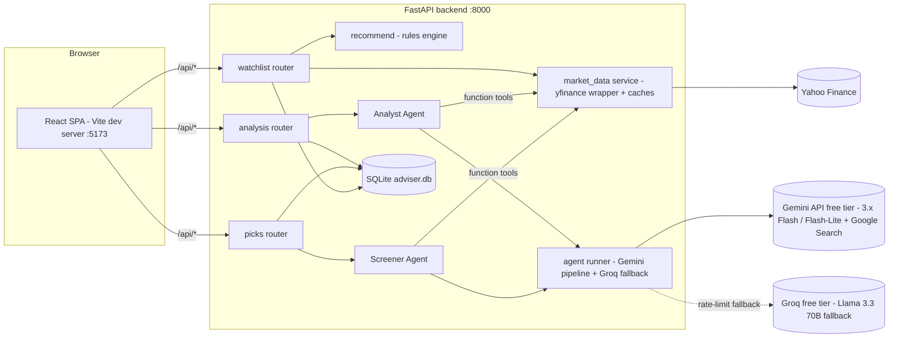
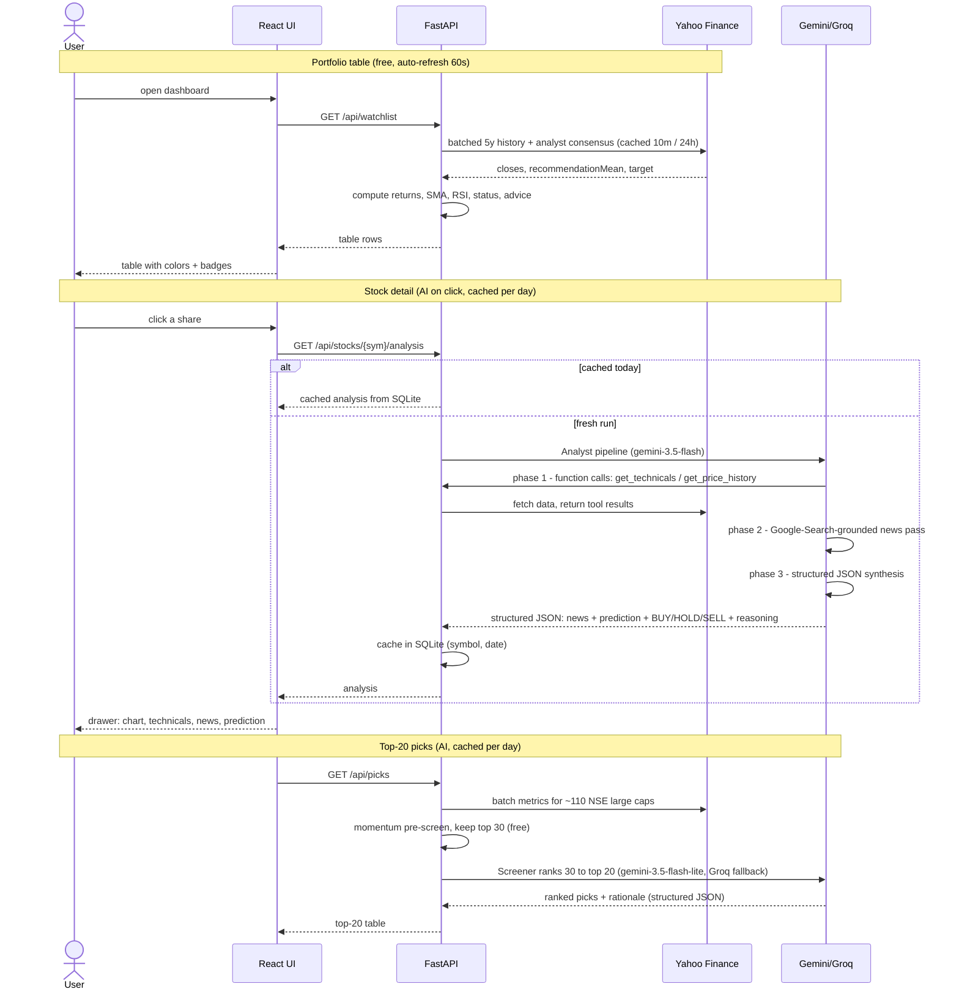
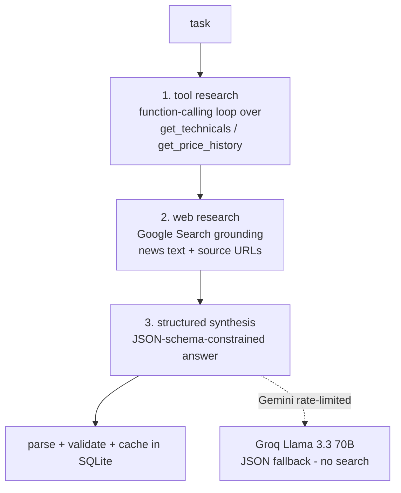

# Design — Indian Stock Portfolio Adviser

A personal dashboard that tracks NSE shares (prices, 1W/1M/1Y/5Y performance,
trend status, buy/hold/sell advice) and uses **agentic AI** for per-stock news +
predictions and a top-20 stock screener.

> Everything the app outputs is informational only — **not financial advice**.

## 1. System architecture



Three layers with a hard boundary between them:

| Layer | Cost | Latency | Used for |
|---|---|---|---|
| **Deterministic market data** (`market_data.py` + `recommend.py`) | free | seconds | Main table: prices, returns, status color, base advice |
| **Rules engine** (`recommend.py`) | free | instant | Status 🟢🟠🔴 + BUY MORE/HOLD/SELL from technicals + analyst consensus |
| **Agentic AI** (`agents/`) | free tier (Gemini, Groq fallback) | minutes | On-demand: per-stock news digest + prediction; daily top-20 screener |

The main table never waits on AI; AI results are cached in SQLite per day and
refreshed only on user request.

## 2. End-to-end flow



## 3. Agentic AI system design

Both agents run on shared primitives (`agents/runner.py`) built on the **Gemini
API free tier**. Gemini does not allow Google-Search grounding, custom function
tools, and strict JSON output in one request, so an agent run is an explicit
three-phase pipeline:



Key properties:

- **Tools ground every claim.** The model cannot invent prices — quantitative
  facts come from function tools backed by the same `market_data.py` the table
  uses; news comes from the Google-Search-grounded pass, whose citation URLs
  are handed to the synthesis step.
- **Structured outputs.** The final answer is constrained to a JSON schema
  (`response_json_schema`), so the frontend renders typed fields, never free text.
- **Bounded loop.** Max 8 tool turns per research phase; tool errors are returned
  to the model as JSON so it can adapt; quota/rate/auth failures map to clear 503s.

### Agents

| Agent | Trigger | Pipeline | Output |
|---|---|---|---|
| **Analyst** (`gemini-3.5-flash`) | Click a share / "Refresh AI analysis" | tool research → grounded news → synthesis | 3–6 sourced news items, short-term (1–3 mo) + long-term (1–3 yr) prediction with confidence, BUY/HOLD/SELL + reasoning |
| **Screener** (`gemini-3.5-flash-lite`, Groq fallback) | Top-20 table load / "Refresh picks" | synthesis only (candidates carry their metrics) | Ranked top-20 with one-line rationale each + a market note |

The screener is **hybrid**: a free deterministic momentum/trend pre-screen over
the ~110-name universe (`nifty100.json`) selects 30 candidates; the model only
ranks those 30 — AI judgment where it adds value, arithmetic in code.

### Model usage (all free tiers)

| Model | Where | Purpose | Why this model |
|---|---|---|---|
| **`gemini-3.5-flash`** | Analyst Agent | Deep single-stock research: tool loop, grounded news, prediction + call | Best free-tier model that has Google Search grounding — the analyst's core need |
| **`gemini-3.5-flash-lite`** | Screener Agent, chat | Rank pre-scored candidates; RAG chat turns | Highest free-tier daily quota; the tasks are mechanical/conversational |
| **`gemini-embedding-001`** | RAG index | Embed research chunks + chat queries | Free (10M tokens/min) |
| **Groq `llama-3.3-70b-versatile`** | Fallback | Screener synthesis + chat when Gemini is rate-limited | Independent free quota; fast; no web search, so the analyst's news phase stays Gemini-only |

All overridable via `ANALYST_MODEL` / `SCREENER_MODEL` / `CHAT_MODEL` / `GROQ_MODEL` in `backend/.env`.

## 3b. Auth, chat (RAG), and voice

**Authentication (JWT).** `POST /api/auth/login` checks credentials from
`backend/.env` (`AUTH_USERNAME`/`AUTH_PASSWORD`) and issues a 24-hour HS256 JWT;
every other `/api` route requires it as a Bearer token (401 otherwise). The
signing secret is auto-generated once into gitignored `backend/jwt_secret.key`.
The React app stores the token in localStorage, attaches it to every request,
and drops back to the login page on any 401.

**Research chat (RAG).** A floating chat panel answers questions grounded in the
app's own agentic research:

```mermaid
flowchart LR
    Q[user question - typed or spoken] --> E[embed query\ngemini-embedding-001 (free)]
    subgraph Index [rag_chunks in SQLite]
        A1[each Analyst run → 1 chunk]
        A2[each Screener run → 1 chunk]
    end
    E --> R[cosine top-5 retrieval\nkeyword fallback if embeddings unavailable]
    Index --> R
    R --> C[gemini-3.5-flash-lite chat turn (Groq fallback)\ncontext = retrieved research + live watchlist snapshot]
    C --> Ans[answer + grounded-in sources shown in UI]
```

Every Analyst/Screener result is flattened to text and indexed (with a Gemini
embedding) the moment it is cached, so the chat corpus grows as you use the app.
Users can also **upload their own files** (📎 in the chat header — PDF via pypdf,
plus txt/md/csv/json): they are chunked (~1,400 chars on paragraph boundaries),
embedded, and stored in the same `rag_chunks` table under `file:` doc-keys, with
list/delete management (`/api/documents`).
The reply cites which stock/date research it drew on; if nothing matches, it
says so and points you at generating the analysis first.

**Voice commands.** The chat's mic button uses the browser's Web Speech API
(`SpeechRecognition`, `en-IN`) — speech is transcribed client-side in Chrome and
sent as a normal chat message. No audio ever reaches the backend.

## 4. Data model (SQLite)

| Table | Key | Contents |
|---|---|---|
| `watchlist` | `symbol` | User's shares (seeded with the initial 12) |
| `ai_analysis` | `(symbol, date)` | Analyst Agent result JSON — one per stock per day |
| `ai_picks` | `date` | Screener result JSON — one per day |
| `rag_chunks` | `id` (`doc_key` indexed) | Chat's RAG corpus: flattened research text + embedding |

In-process caches (not persisted): price history 10 min, analyst consensus 24 h.

## 5. API surface

| Endpoint | Behavior |
|---|---|
| `GET /api/watchlist` | Full table (prices, returns, status, advice) |
| `POST /api/watchlist` / `DELETE /api/watchlist/{symbol}` | Add / remove a share |
| `GET /api/search?q=` | NSE symbol lookup for the add dialog |
| `GET /api/stocks/{symbol}/history?period=` | Chart series (1w/1m/1y/5y) |
| `GET /api/stocks/{symbol}/analysis[?refresh=true]` | Cached / fresh AI analysis |
| `GET /api/picks[?refresh=true]` | Cached / fresh top-20 |
| `POST /api/auth/login` | Credentials → JWT (the only public endpoint besides health) |
| `POST /api/chat` | RAG-grounded chat: `{message, history}` → `{reply, sources}` |

## 6. Cost, resilience, security

- **AI spend is bounded by design:** per-day caching, the free pre-screen, a
  cheaper model for the bulk task, low reasoning effort where quality allows,
  thinned tool payloads (≤ ~60 chart points), and a hard turn limit.
- **Yahoo fragility is contained:** every Yahoo call lives in `market_data.py`
  behind caches; if yfinance breaks, only that module changes.
- **Secrets:** `GEMINI_API_KEY` / `GROQ_API_KEY` live in `backend/.env`, which is gitignored and
  never appears in code, docs, or the repo.
- **Degradation:** without a key (or with an out-of-credit account) the entire
  market-data experience still works; AI panels show the specific reason.
