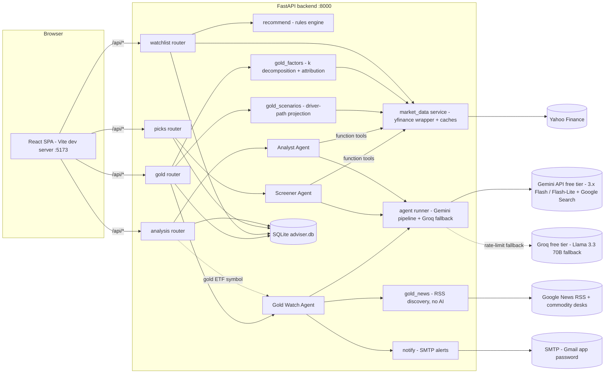
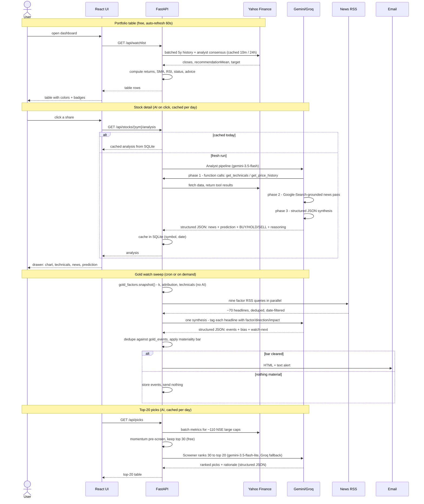
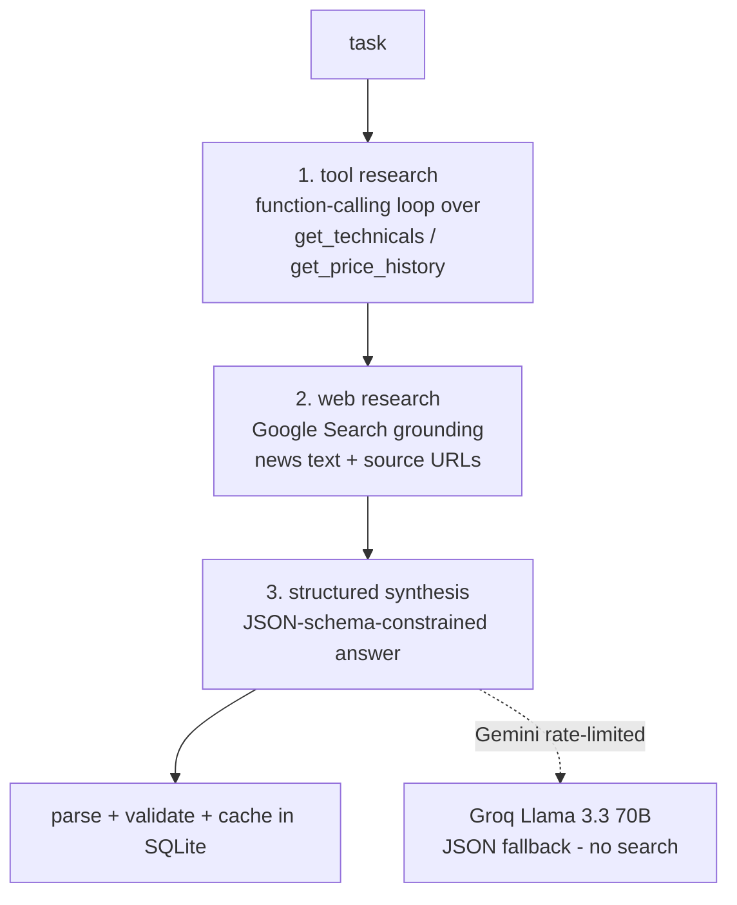
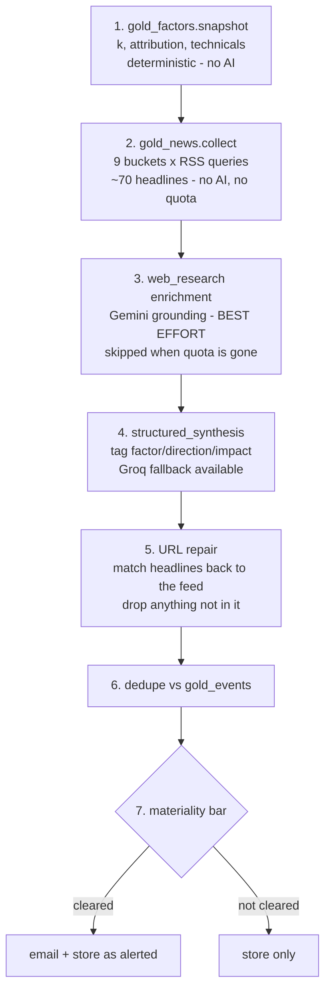

# Design — Indian Stock Portfolio Adviser

A personal dashboard that tracks NSE shares (prices, 1W/1M/1Y/5Y performance,
trend status, buy/hold/sell advice) and uses **agentic AI** for per-stock news +
predictions, a top-20 stock screener, and a standing macro-factor watch on gold
that emails when something material moves.

> Everything the app outputs is informational only — **not financial advice**.

## 1. System architecture



Layers with a hard boundary between them — cost and latency rise as you go down,
and nothing above ever waits on anything below:

| Layer | Cost | Latency | Used for |
|---|---|---|---|
| **Deterministic market data** (`market_data.py` + `recommend.py`) | free | seconds | Main table: prices, returns, status color, base advice |
| **Rules engine** (`recommend.py`) | free | instant | Status 🟢🟠🔴 + BUY MORE/HOLD/SELL from technicals + analyst consensus |
| **Agentic AI** (`agents/`) | free tier (Gemini, Groq fallback) | minutes | On-demand: per-stock news digest + prediction; daily top-20 screener |
| **Factor maths** (`gold_factors.py`, `gold_scenarios.py`) | free | seconds | Gold ETF decomposition, return attribution, scenario projection — deterministic, no AI |
| **News discovery** (`gold_news.py`) | free | ~2 s | RSS sweep across nine gold factor buckets; deliberately quota-free |

The main table never waits on AI; AI results are cached in SQLite per day and
refreshed only on user request.

## 2. End-to-end flow



## 3. Agentic AI system design

> Deep dive with full reasoning: [AGENTIC_AI_DESIGN.md](AGENTIC_AI_DESIGN.md).

Both agents run on shared primitives (`agents/runner.py`) built on the **Gemini
API free tier**. Gemini does not allow Google-Search grounding, custom function
tools, and strict JSON output in one request, so an agent run is an explicit
three-phase pipeline:



Key properties:

- **Tools ground every claim.** The model cannot invent prices — quantitative
  facts come from function tools backed by the same `market_data.py` the table
  uses; news comes from the Google-Search-grounded pass, whose citation URLs
  are handed to the synthesis step.
- **Structured outputs.** The final answer is constrained to a JSON schema
  (`response_json_schema`), so the frontend renders typed fields, never free text.
- **Bounded loop.** Max 8 tool turns per research phase; tool errors are returned
  to the model as JSON so it can adapt; quota/rate/auth failures map to clear 503s.

### Agents

| Agent | Trigger | Pipeline | Output |
|---|---|---|---|
| **Analyst** (`gemini-3.5-flash`) | Click a share / "Refresh AI analysis" | tool research → grounded news → synthesis | 3–6 sourced news items, short-term (1–3 mo) + long-term (1–3 yr) prediction with confidence, BUY/HOLD/SELL + reasoning |
| **Screener** (`gemini-3.5-flash-lite`, Groq fallback) | Top-20 table load / "Refresh picks" | synthesis only (candidates carry their metrics) | Ranked top-20 with one-line rationale each + a market note |
| **Gold Watch** (`gemini-3.5-flash`, Groq fallback) | Cron sweep, `POST /api/gold/watch`, or opening a gold ETF in the drawer | factor snapshot → RSS discovery → synthesis | Up to 12 factor-tagged events, overall rupee-gold bias, GOLDBEES note, watch-next list — plus an email if the materiality bar is cleared |

The screener is **hybrid**: a free deterministic momentum/trend pre-screen over
the ~110-name universe (`nifty100.json`) selects 30 candidates; the model only
ranks those 30 — AI judgment where it adds value, arithmetic in code.

### Model usage (all free tiers)

| Model | Where | Purpose | Why this model |
|---|---|---|---|
| **`gemini-3.5-flash`** | Analyst Agent | Deep single-stock research: tool loop, grounded news, prediction + call | Best free-tier model that has Google Search grounding — the analyst's core need |
| **`gemini-3.5-flash-lite`** | Screener Agent, chat | Rank pre-scored candidates; RAG chat turns | Highest free-tier daily quota; the tasks are mechanical/conversational |
| **`gemini-embedding-001`** | RAG index | Embed research chunks + chat queries | Free (10M tokens/min) |
| **Groq `llama-3.3-70b-versatile`** | Fallback | Screener synthesis + chat when Gemini is rate-limited | Independent free quota; fast; no web search — which is why the Gold Watch *can* fall back to it (its sources come from RSS) while the Analyst cannot (its sources come from Gemini's own citations) |
| **`gemini-3.5-flash`** | Gold Watch Agent | Tag ~70 RSS headlines with factor/direction/impact; write the bias | Judgment over supplied text, not retrieval; overridable via `GOLD_WATCH_MODEL` |

All overridable via `ANALYST_MODEL` / `SCREENER_MODEL` / `CHAT_MODEL` / `GOLD_WATCH_MODEL` / `GROQ_MODEL` in `backend/.env`.

## 3a. Fundamental metrics

The portfolio table and the rules engine were entirely **technical** — price
versus moving averages, momentum, RSI, analyst consensus. That answers "what is
the price doing" and says nothing about "what is the business doing".
`app/fundamentals.py` adds 20 fundamental metrics in five groups (valuation,
profitability, growth, financial health, income), each shipped with what it is,
how to read it, and its caveat — a bare ratio the reader has to go and look up
is not information.

### Two Yahoo quirks that had to be corrected, not displayed

**Mixed currencies.** Some Indian companies report financials in USD while their
share is quoted in INR — Infosys returns `currency=INR` with
`financialCurrency=USD`. Yahoo divides an INR market cap by USD revenue, so any
ratio spanning the two is wrong by exactly the USDINR rate:

| Metric | Yahoo | Corrected |
|---|---|---|
| P/S | 205.98 | **2.17** |
| EV/EBITDA | 977.15 | **10.28** |

`get_fundamentals()` detects the mismatch, rescales the affected ratios using the
USDINR series the gold agent already fetches, and records which ones it repaired
so the UI can show an `fx` marker and explain itself. Ratios built from a single
currency (P/E, P/B, ROE, margins, growth) are untouched.

**Beta measured against the wrong index.** Yahoo's beta for NSE tickers is
computed against a US index, producing values like −0.09 for ITC against its own
market. Beta is recomputed here from ~2 years of daily returns against `^NSEI`:
INFY 0.93 and HDFCBANK 1.09, versus Yahoo's 0.11 and 0.40.

### Bands are sector-relative, and some metrics are suppressed

A P/E of 30 is rich for a bank and ordinary for an FMCG name, so thresholds carry
per-sector overrides. More importantly, metrics that are **not real quantities**
for a sector are hidden rather than scored: debt-to-equity, current ratio,
EV/EBITDA and operating margin are suppressed for lenders, because borrowing is
their raw material rather than a risk signal (Yahoo returns a literal `0.0` gross
margin for HDFC Bank).

### Combinations, not single ratios

The scorecard rolls metrics into five pillars (value / quality / growth / safety /
income) and then matches the numbers against six classic **playbooks** — quality
compounder, GARP, classic value, income, plus two deliberately negative ones:
*value trap* (low P/E with falling revenue **and** falling earnings) and
*leverage-flattered returns* (high ROE, low ROA, high debt). Single ratios almost
never decide anything, and the same P/E means opposite things beside different
companions; the negative patterns exist because the most expensive mistake is
mistaking a deteriorating business for a bargain.

`GET /api/stocks/{symbol}/fundamentals` returns the scorecard;
`GET /api/stocks/fundamentals/guide` returns the whole catalogue and playbooks as
a reference.

**This is deliberately not folded into the BUY/HOLD/SELL score.** The table's
advice is a technical + consensus call today, and silently changing what it means
would move every badge in the portfolio without anyone asking for it. The
fundamental factors are computed and returned (`factors`), ready to blend if that
is ever wanted.

## 3a2. Suggested position sizing

A BUY badge says *whether*, not *how much* — and position sizing is where the
larger mistakes are made. `app/allocation.py` adds a **Suggested** column to both
the portfolio table and the top-20 picks, using two standard ideas and three hard
constraints.

**Inverse-volatility weighting (risk parity).** Equal rupees is not equal risk. A
45%-vol small cap and a 20%-vol large cap held at the same weight contribute
wildly different amounts of portfolio movement, and the volatile one quietly
dominates the outcome. Dividing the weight by volatility equalises what each name
contributes. This is visible in the live output: Divi's Labs ranks 4th but at
23.8% vol gets **8.6%**, while top-ranked Samvardhana Motherson at 33.5% vol gets
**6.8%** — a higher rank earning a smaller slice because it is riskier.

**Conviction tilt.** The inverse-vol weight is multiplied by a 0-1 conviction
score from the same technical + consensus signals as the BUY/HOLD/SELL badge,
tilted ±20% by the fundamental pillars where they exist. Names with a negative
score get nothing rather than a token slice.

**Three caps**, because the failure mode of every scoring model is concentration:

| Constraint | Value |
|---|---|
| Single name | 15% |
| Single sector | 35% |
| Drop below | 2% (a 1% position is noise, not diversification) |

The caps interact — capping a name frees weight that can push a sector over, and
scaling a sector down frees weight that can push a name over — so they are applied
in an **alternating loop until both hold**, not once each. Applying them in
sequence lets the second silently undo the first, which is exactly what the first
implementation did (it produced a 40% position against a 15% cap).

**Cash is explicit.** The deployed share of the basket scales with mean
conviction, so a weak-looking basket is not force-fitted to 100% invested. Where
a constraint *cannot* be honoured the model says so rather than hiding it: a
single-sector basket cannot satisfy a sector cap, and a basket where only five
names clear the bar cannot deploy more than 5 × 15% = 75%. Both cases emit a
plain-English warning under the table.

**What it is not.** The weights are a share of *this basket*, not of net worth.
The model has no knowledge of income, age, horizon, tax position, existing assets
or cash needs, so it is a mechanical output of stated inputs rather than personal
advice — `per_symbol[sym].reason` returns the arithmetic behind every number.

## 3b. Auth, chat (RAG), and voice

**Authentication (JWT).** `POST /api/auth/login` checks credentials from
`backend/.env` (`AUTH_USERNAME`/`AUTH_PASSWORD`) and issues a 24-hour HS256 JWT;
every other `/api` route requires it as a Bearer token (401 otherwise). The
signing secret is auto-generated once into gitignored `backend/jwt_secret.key`.

There is **no fallback password**. `auth.verify_configured()` runs in the FastAPI
startup hook, before `init_db()` and before a single request is served, and
raises if `AUTH_PASSWORD` is unset *or* is still the example value published in
`.env.example`. An earlier version fell back to a hardcoded default, which meant
a missing or renamed `.env` silently downgraded the app from "locked" to "open on
a password printed in the README" — while continuing to serve traffic. A
dashboard that refuses to boot is a visible problem; one quietly serving on a
public password is not. A valid-but-short password starts with a loud warning
rather than a hard failure, so a length rule can never lock the owner out.
The React app stores the token in localStorage, attaches it to every request,
and drops back to the login page on any 401.

**Research chat (RAG).** A floating chat panel answers questions grounded in the
app's own agentic research:

```mermaid
flowchart LR
    Q[user question - typed or spoken] --> E[embed query\ngemini-embedding-001 (free)]
    subgraph Index [rag_chunks in SQLite]
        A1[each Analyst run → 1 chunk]
        A2[each Screener run → 1 chunk]
    end
    E --> R[cosine top-5 retrieval\nkeyword fallback if embeddings unavailable]
    Index --> R
    R --> C[gemini-3.5-flash-lite chat turn (Groq fallback)\ncontext = retrieved research + live watchlist snapshot]
    C --> Ans[answer + grounded-in sources shown in UI]
```

Every Analyst/Screener result is flattened to text and indexed (with a Gemini
embedding) the moment it is cached, so the chat corpus grows as you use the app.
Users can also **upload their own files** (📎 in the chat header — PDF via pypdf,
plus txt/md/csv/json): they are chunked (~1,400 chars on paragraph boundaries),
embedded, and stored in the same `rag_chunks` table under `file:` doc-keys, with
list/delete management (`/api/documents`).
The reply cites which stock/date research it drew on; if nothing matches, it
says so and points you at generating the analysis first.

**Voice commands.** The chat's mic button uses the browser's Web Speech API
(`SpeechRecognition`, `en-IN`) — speech is transcribed client-side in Chrome and
sent as a normal chat message. No audio ever reaches the backend.

## 3c. The Gold Watch agent

A gold ETF has no earnings, no management and no order book, so the Analyst
Agent's whole research strategy — tool-call the technicals, search for company
news, synthesise — has nothing to bite on. GOLDBEES needed a different agent,
built around a different question: **which link in the chain moved?**

### The price identity (the low-level idea everything rests on)

```
GOLDBEES  =  k  x  gold_usd_per_oz  x  USDINR / 31.1035
```

`k` is the grams of gold backing one unit, multiplied by the Indian domestic
premium (import duty + local scarcity + the fund's expense drag). Three
independent drivers, only one of which is gold. `gold_factors.py` computes `k`
from observed prices every run and attributes each return window to the three
legs, which is what lets the system distinguish three things that look identical
on a price chart:

| Observation | Which leg moved | What to watch |
|---|---|---|
| Gold rallied in dollars | `gold_usd` | Fed, real yields, central banks, geopolitics |
| The rupee weakened | `USDINR` | RBI, oil, current account, FII flows |
| Delhi changed the import duty | `k` | Budget, customs notifications, CBIC |

The decomposition is empirically load-bearing, not decorative: `k` steps **+8.3%**
between April and June 2026, matching India's 6% → 15% duty hike of May 2026.
Over 2026 to date the ETF gained ~13% while dollar gold was flat — the entire
move was rupee and duty. An agent that only watched "gold news" would have had
nothing to say about the year's actual return.

### Factor taxonomy

Nine buckets, each a distinct transmission channel. Every headline is tagged to
exactly one, and every event carries a direction for the **rupee** price of gold
— not the dollar price, which frequently points the other way.

| Channel | Buckets |
|---|---|
| → gold in USD | `fed_rates`, `dollar`, `central_banks`, `geopolitics`, `etf_flows`, `supply` |
| → the USD→INR leg | `inr` |
| → the domestic premium | `india_policy`, `india_demand` |

### Pipeline



**Discovery is deliberately not AI.** The first build used Gemini's
Google-Search grounding to find the news and returned *zero events* on its first
live run — the small free daily search quota was already spent. A watcher that
goes silently blind is the one failure mode that matters, so discovery moved to
plain RSS (free, unmetered, ~2 s for 70 headlines) and the model was demoted to
tagging and scoring what the feeds return. AI grounding remains as best-effort
enrichment; when it is unavailable the sweep is unaffected.

Because the sources now come from RSS rather than from Gemini's own citations,
the synthesis step can fall back to **Groq** — unlike the Analyst, whose news
phase is Gemini-only. Step 5 then repairs the output: every event's URL, source
and date are overwritten from the matched feed entry, so a model that
paraphrases a headline cannot invent a link to go with it.

### The materiality bar (`gold_alerts.py`)

An alert fires when **any** of these is true; everything else is stored silently.

| Trigger | Threshold | Why |
|---|---|---|
| New high-impact event | any | Regime change: FOMC, duty change, war |
| Clustered medium events | ≥ 3 new | Second-order pushes that add up to one story |
| Single-session move | ≥ ±2% | Real at 32.5% annualised volatility |
| Domestic premium move | ≥ ±2% in a month | The import-duty tripwire — `k` only moves on policy |
| Factor bias flip | bullish ⇄ bearish | Direction changing beats any single headline |
| RSI-14 leaves 30–70 | — | Positioning extreme; is the news already priced? |

Dedupe is the first 16 hex characters of a SHA-1 over
`factor + normalised headline + source`, stored as the `gold_events` primary key — so the same story found on three consecutive sweeps
is emailed once. The bar exists because a watcher that emails every headline
gets muted within a week, and a muted watcher is worse than none.

### Routing into the existing dashboard

`GET /api/stocks/{symbol}/analysis` checks `gold_watch.is_gold_etf()` and routes
gold ETFs here instead of to the Analyst. `gold_alerts.as_stock_analysis()`
projects the sweep into the Analyst's `ANALYSIS_SCHEMA` shape, so the existing
StockDrawer renders it unchanged and the existing RAG indexer picks it up with
no special case. The symbol list is **explicit**, not a substring match on
"GOLD" — `GOLDIAM` is a jewellery equity and would be misrouted into a macro
agent by a naive match.

### Guardrails and evaluation

An on-demand agent has a human error detector: someone clicked, someone is
waiting, and a wrong answer is seen. The Gold Watch has none, so its output is
checked mechanically before it reaches anyone.

The governing rule is **flag, don't drop**. A violation adds trust metadata and
a recorded reason; it never deletes the model's work, because silently shrinking
a report is how a monitor lies to you. The single exception is an unverifiable
*link* — a URL cannot be "marked untrusted", since a reader still clicks it, so
an unsourced event keeps its text and loses its href. The drawer already renders
`url ? <a> : <b>`, so it degrades to plain text on its own.

| Guard | Catches | On a hit |
|---|---|---|
| Provenance | Event headline in no feed | `trust=unverified`, URL stripped |
| Enum validity | `factor`/`direction`/`impact`/`horizon` out of range — **the Groq fallback only advises schemas, it does not enforce them** | coerce to safest, `trust=suspect` |
| Date sanity | Future-dated or older than 45 days | `trust=suspect` |
| Injection | RSS headline reading as an instruction | item kept but labelled in the prompt |
| Advice language | Directives ("you should buy") and guarantees | disclaimer appended, never a silent rewrite |
| Numeric drift | Prose citing a price/return/premium that contradicts the snapshot | flagged |
| Feed health | Too few headlines, or dead buckets | **a distinct "watcher degraded" email** |
| Send limits | 6 alerts/24 h, 45 min cooldown, >70% high-impact | send suppressed, reason recorded on the run |

Two of these deserve their reasoning stated.

**Untrusted input is now delimited.** RSS titles are third-party text that was
being interpolated raw into a markdown prompt, so a headline containing `###`
could forge the prompt's own structure. `sanitize_feed()` strips that structure
and `as_prompt_block()` wraps the feed in explicit markers that tell the model
the block is data to classify, never instructions.

**Silence is now always explained.** `gold_news._fetch` swallows feed errors and
returns `[]`, so nine dead feeds and a genuinely quiet market produced identical
output: no events, no alert. That is the silent-blindness failure the RSS switch
was meant to prevent, reintroduced one layer down. `check_feed_health()` turns it
into its own alert — a watcher must never be quiet for a reason it could report.

**Evaluation** lives in `backend/eval_gold.py`, mirroring `eval_rag.py`'s
conventions (runnable script, no pytest — there is no test infrastructure in this
repo). Four suites:

| Suite | Measures | Cost |
|---|---|---|
| Adversarial | 12 fixtures that must each trip a named guard | none — no model, no network |
| Tagging | factor/direction/impact **precision** and noise rejection vs `gold_eval_golden.json` (42 hand-labelled real headlines, 29% of them off-topic) | one model call |
| Provenance | share of events traceable to a supplied headline — **floored at 1.0**, since the shortfall is the hallucination rate | free |
| Prose judge | numeric faithfulness and advice-neutrality of the bias summary, 1–5 | one model call |

Floors are set on precision, noise rejection and provenance. **Coverage is
reported but not floored**: the agent is instructed to select the ~12 most
material items, so a relevant headline it skipped is a decision, not an error —
conflating the two made the harness's first run fail at 0.267 while every label
it had actually produced was correct.

### Scenario projection (`gold_scenarios.py`)

Forecasting the ETF directly is guesswork; forecasting its three inputs is a
research question with published answers. Each scenario is an explicit dated
path for `gold_usd`, `USDINR` and `k`, log-linearly interpolated, with the ETF
price falling out of the identity. Every projection is therefore auditable —
disagree with an input and you can see exactly what it does to the output. A
±1σ cone at realised volatility is drawn alongside, and it is wider than the
spread between the scenarios, which is the honest headline.

## 4. Data model (SQLite)

| Table | Key | Contents |
|---|---|---|
| `watchlist` | `symbol` | User's shares (seeded with the initial 12) |
| `ai_analysis` | `(symbol, date)` | Analyst Agent result JSON — one per stock per day |
| `ai_picks` | `date` | Screener result JSON — one per day |
| `rag_chunks` | `id` (`doc_key` indexed) | Chat's RAG corpus: flattened research text + embedding |
| `ai_holders` | `symbol` | Major-shareholder lookups (30-day TTL) |
| `chat_log` | `id` | One row per chat turn — provider, retrieval mode, top score, latency |
| `eval_runs` | `id` | Stored `eval_rag.py` results, surfaced by `/api/metrics` |
| `gold_events` | `id` = SHA-1(factor+headline+source) | Every gold factor event seen, with direction/impact/horizon and whether it was emailed. The hash key **is** the dedupe mechanism |
| `gold_watch_runs` | `id` | Audit trail per sweep: bias, ETF price, events found/new, emailed, email error, suppression reason, violation count, full payload |
| `guardrail_violations` | `id` | Every guardrail hit, with severity and the run that produced it. Flag-don't-drop only means something if the flags are kept |
| `gold_eval_runs` | `id` | `eval_gold.py` results. Deliberately **not** `eval_runs`: `/api/metrics` renders the latest row there as the RAG scorecard, so gold results would silently replace it |

In-process caches (not persisted): price history 10 min, analyst consensus 24 h.

`gold_events` is the only table whose primary key carries meaning. Making the
content hash the key means a duplicate insert is a no-op by construction rather
than by a query — dedupe cannot be forgotten at a call site.

## 5. API surface

| Endpoint | Behavior |
|---|---|
| `GET /api/watchlist` | Full table (prices, returns, status, advice, suggested weight) + basket `allocation` block |
| `POST /api/watchlist` / `DELETE /api/watchlist/{symbol}` | Add / remove a share |
| `GET /api/search?q=` | NSE symbol lookup for the add dialog |
| `GET /api/stocks/{symbol}/history?period=` | Chart series (1w/1m/1y/5y) |
| `GET /api/stocks/{symbol}/analysis[?refresh=true]` | Cached / fresh AI analysis |
| `GET /api/stocks/{symbol}/fundamentals` | 20 fundamental metrics, each explained, grouped into pillars, with matched playbooks |
| `GET /api/stocks/fundamentals/guide` | The metric catalogue and combination playbooks as a standalone reference |
| `GET /api/picks[?refresh=true]` | Cached / fresh top-20 |
| `POST /api/auth/login` | Credentials → JWT (the only public endpoint besides health) |
| `POST /api/chat` | RAG-grounded chat: `{message, history}` → `{reply, sources, provider, retrieval_mode}`; every turn logged to `chat_log` |
| `GET /api/stocks/{symbol}/holders[?refresh=true]` | Major shareholders: AI grounded lookup (30-day cache, circuit breaker) with Yahoo structural/named fallback |
| `GET /api/metrics` | RAG corpus health, cache state, chat quality (provider/fallback rates, similarity, latency), latest eval results, gold-watch stats + email config state |
| `GET /api/gold/factors` | Live factor board: technicals, drivers, `k`, attribution, correlations (deterministic, no AI) |
| `GET /api/gold/history?days=` | Daily ETF / gold / USDINR / `k` series for charting |
| `GET /api/gold/scenarios[?horizon=]` | Driver-path scenarios, ±1σ cone, probability-weighted endpoints |
| `GET /api/gold/sensitivity` | GOLDBEES across a gold × USDINR grid |
| `POST /api/gold/watch[?force_email=]` | Run a sweep now; emails if the materiality bar is cleared |
| `GET /api/gold/latest` | Most recent sweep from cache (no AI call) |
| `GET /api/gold/events[?factor=&limit=]` | Stored factor events |
| `GET /api/gold/runs` | Sweep history with bias and email outcome |
| `GET /api/gold/alerts/config` · `POST /api/gold/alerts/test` | SMTP config state; send a test email |
| `GET /api/gold/violations[?kind=&limit=]` | Guardrail audit trail — what the agent got wrong, and how often |
| `GET /api/gold/eval` | Latest `eval_gold.py` results |

## 6. Cost, resilience, security

- **AI spend is bounded by design:** per-day caching, the free pre-screen, a
  cheaper model for the bulk task, low reasoning effort where quality allows,
  thinned tool payloads (≤ ~60 chart points), and a hard turn limit.
- **Yahoo fragility is contained:** every Yahoo call lives in `market_data.py`
  behind caches; if yfinance breaks, only that module changes.
- **Model output is not trusted by default.** Every field the Gold Watch emits is
  checked before use (§3c) — enums because the Groq fallback does not enforce
  schemas, provenance because a plausible URL is not a real one, and prose
  because a system prompt saying "not financial advice" is a request, not a
  guarantee. `app/safety.py` holds the one disclaimer string and the advice
  scanner that checks whether the model listened.
- **Quota independence for the watcher:** gold news discovery is RSS, so the
  standing monitor keeps working after the daily AI search quota is exhausted —
  the component that must not fail silently has no metered dependency.
- **Secrets:** `GEMINI_API_KEY` / `GROQ_API_KEY` / `SMTP_PASSWORD` live in
  `backend/.env`, which is gitignored and never appears in code, docs, or the
  repo. `.env.example` ships **no working password** — the auth gate refuses the
  old example value by name so a verbatim copy fails loudly.
- **Auth fails closed.** Startup aborts on a missing or example `AUTH_PASSWORD`
  (§3b). Rotating `AUTH_PASSWORD` should be paired with deleting
  `jwt_secret.key`: tokens signed with the old secret stay valid for 24 h, so a
  password change alone does not end existing sessions.
- **Network exposure is opt-in and one-sided.** `vite.config.js` sets
  `host: true` so the SPA is reachable from a phone on the same Wi-Fi, but
  uvicorn stays bound to `127.0.0.1` — the API is reached only through the dev
  server's proxy, never directly from the network. There is no TLS and no rate
  limiting; this is a LAN-only posture, not an internet-facing one.
- **Email is best-effort, never load-bearing.** A dead SMTP host is caught,
  recorded in `gold_watch_runs.email_error` and surfaced in `/api/metrics`; the
  research is still stored. Alert delivery failing must not lose the analysis.
- **Degradation:** without a key (or with an out-of-credit account) the entire
  market-data experience still works; AI panels show the specific reason; the
  gold factor board, attribution and scenarios work with no AI at all.
