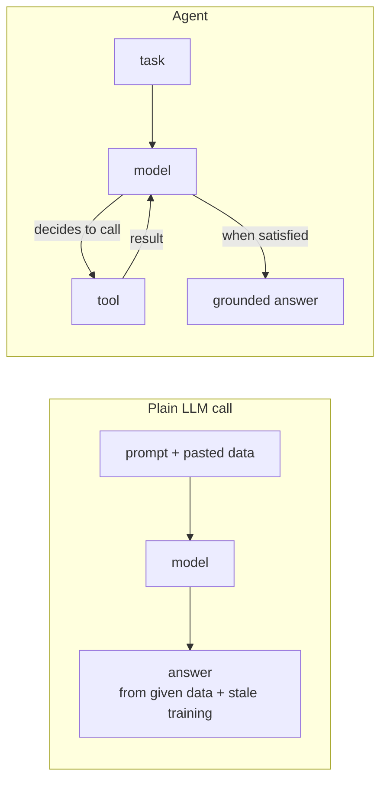
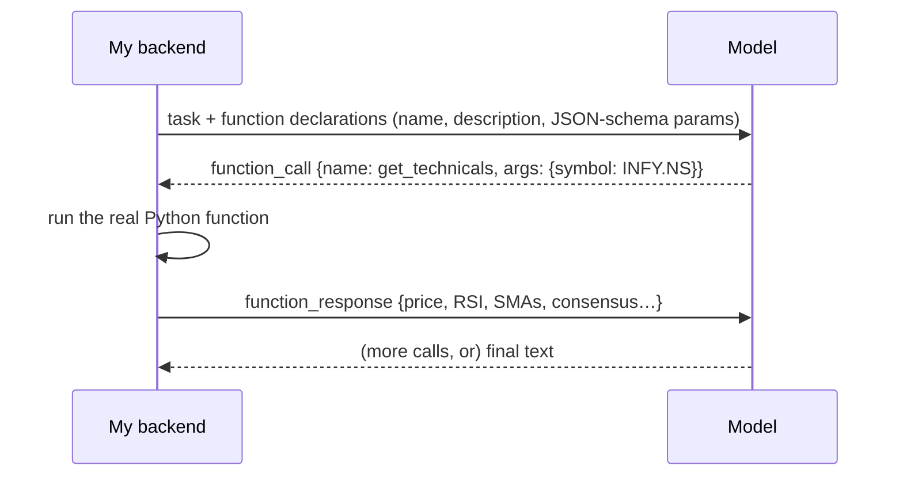
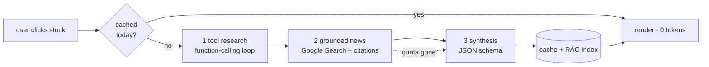
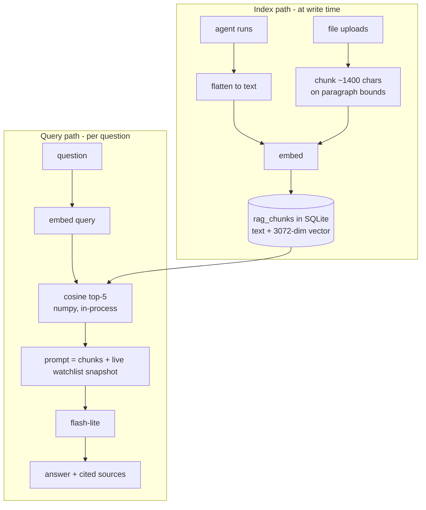
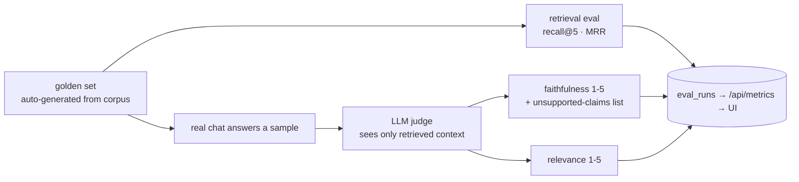
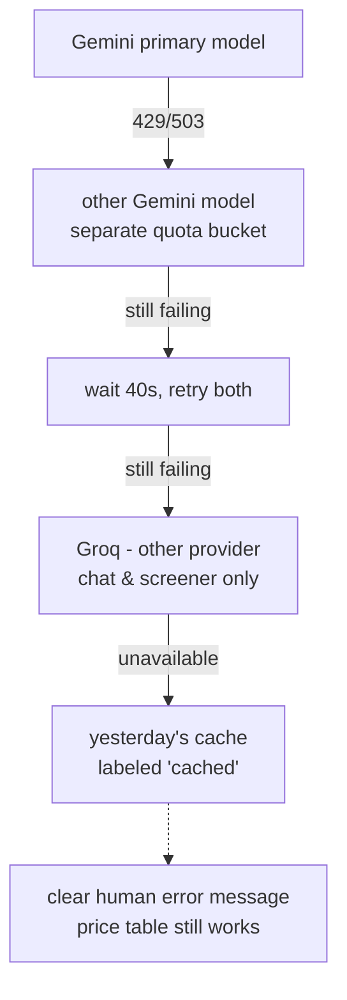

# Interview Prep — Agentic AI & RAG (grounded in this project)

Questions an interviewer could ask about this project's AI design, with crisp
answers you can defend — because every answer points at something this repo
actually does. Read alongside [AGENTIC_AI_DESIGN.md](AGENTIC_AI_DESIGN.md).

**How to use this:** answer out loud before reading the answer. The strongest
interview answers follow the shape *concept → how this project does it → the
trade-off I accepted*.

The diagrams below are deliberately simple — **practice drawing each one on
paper in under a minute**; being able to whiteboard the architecture unprompted
is worth more than memorizing any answer.

### Start here — the priority study path

Most interviews are won by a handful of things. Practice in this order:

| Priority | What | Where | Time |
|---|---|---|---|
| 1 | **The 60-second pitch**, out loud, until it's smooth | §0 | 15 min |
| 2 | **The RAG dual-path diagram** — draw it from memory | §3, first diagram | 10 min |
| 3 | **The analyst pipeline diagram** + its two follow-ups | §2, first diagram | 10 min |
| 4 | The chunking answer (1,400 chars + the why) — the most-probed RAG detail | §3 | 5 min |
| 5 | One STAR war story, told out loud in ~90 seconds | §8 | 10 min |
| 6 | The **mock drill**, cold | §10 | 20 min |
| 7 | Everything else — rapid-fire table last, night before | §7 | — |

If you only have one evening: do 1–3. If you have a week: one section per day,
and re-run the mock drill (§10) at the end until nothing takes over two minutes.

---

## 0. The 60-second pitch (open with this when asked "tell me about the project")

> "I built a stock adviser with a three-layer design: a deterministic layer
> computes prices and technical indicators in plain Python; a rules engine
> turns those into an explainable buy/hold/sell baseline; and an agentic AI
> layer does what code can't — an Analyst Agent that researches a stock
> through function tools and live Google-Search grounding, and a screener that
> ranks pre-scored candidates. Everything the agents produce feeds a RAG index
> — SQLite plus in-process cosine search over Gemini embeddings — that powers
> a chat with voice input, grounded in the app's own research plus files the
> user uploads. I run it entirely on free tiers, which forced real engineering:
> per-model quota-bucket fallbacks, cross-provider degradation to Groq, and
> per-day caching. And it's measured — recall@5/MRR on an auto-generated
> golden set and LLM-as-judge faithfulness, surfaced in a metrics API and UI."

Sixty seconds, and it plants hooks for every topic *you* want them to ask about.

---

## 1. Agentic AI fundamentals

**Q. What makes a system "agentic" versus a normal LLM call?**
A plain call is one shot: data in, answer out, no ability to act. An agent is a
model in a **loop with tools** — it decides what to look up, calls a tool,
reads the result, and iterates until it can answer. The intelligence is in the
research behavior, not just the final text. In this project the Analyst Agent
decides for itself whether to pull technicals, price history, or both before
writing its notes.

*Likely follow-ups:* "who decides which tool runs?" (the model — the host only
executes), "what stops infinite loops?" (turn cap — see below).

**Q. Explain function calling. What actually travels over the wire?**
We send the model *function declarations* — name, description, JSON-schema
parameters. The model replies not with text but a structured `function_call`
part (`{name: "get_technicals", args: {symbol: "INFY.NS"}}`). Our code executes
the real Python function and appends a `function_response` part with the JSON
result; the model reads it and continues. The model never executes anything —
it only *requests*; the host owns execution. (Code: `agents/tools.py`,
`runner.tool_research()`.)

*Likely follow-up:* "why does the model never execute code itself?" — security
and control: the host can validate args, gate side effects, and log every call;
the model only ever proposes.

**Q. How do you stop an agent loop from running forever?**
A hard turn cap — 8 tool turns per research phase here. Also: tool *errors* are
returned to the model as JSON rather than raised, so it can adapt instead of
crashing, and the loop exits naturally when the model answers in text.

**Q. What is "grounding" and why does it matter?**
Forcing every claim to trace to a verifiable source: a tool result, a search
citation, or a retrieved document. Without it the model answers from stale
training data — for stocks that means invented prices and fabricated headlines.
Here: prices only come from tools, news only from Google-Search grounding with
citation URLs, chat answers only from retrieved research, and the UI links the
sources so a human can audit any claim.

**Q. Why force structured outputs instead of parsing the model's prose?**
The frontend renders typed fields (badges, enums, link lists). A JSON schema
(`response_json_schema`) guarantees parseability, and enums like
`BUY | HOLD | SELL` stop the model inventing a fourth category. Free prose
would need brittle regex parsing that drifts as the model's style changes.

**Q. When should you NOT build an agent?**
When the task is deterministic. This project's rule: **arithmetic in code,
judgment in the model**. Returns, SMAs, RSI, screening scores, and status
colors are plain Python — free, instant, testable. The model is spent only
where judgment is needed. The main dashboard table involves zero AI calls.

**Q. Single agent, multi-phase pipeline, or multi-agent — how do you choose?**
Smallest thing that does the job. Here the "ideal" single loop was impossible
(Gemini won't mix search grounding + function tools + JSON schema in one
request), so the agent became a three-phase pipeline: tool research → grounded
news → structured synthesis. Full multi-agent (separate news/technical/ranking
agents + orchestrator) was rejected: 3–4× the calls and latency for a two-task
app, and coordination complexity that buys nothing at this scale.

---

## 2. This project's agent design

**Q. Walk me through what happens end-to-end when a user asks for a stock analysis.**
Cache check first (`(symbol, date)` key — a hit costs zero tokens). On a miss:
**Phase 1** — a function-calling loop where `gemini-3.5-flash` pulls technicals
and optionally price history from our yfinance layer and writes research notes
("notes only, no recommendation yet"). **Phase 2** — a Google-Search-grounded
pass gathers recent news; we harvest the citation URLs from
`grounding_metadata`. **Phase 3** — a synthesis call constrained to a JSON
schema combines notes + news + source list into `{news[], prediction{},
recommendation, reasoning}`. The result is cached in SQLite and flattened into
the RAG index so the chat can use it.

*Likely follow-ups:* "why three phases instead of one loop?" (provider
constraint turned into separation of concerns), "what if phase 2 fails?" (the
dotted edge — degrade to technicals-only, never invent news).

**Q. Why two different system prompts inside one agent run?**
Phase 1's prompt forbids a recommendation ("notes only"); phase 3's prompt
governs judgment. Separating *gather* from *judge* prevents the model from
anchoring on a premature conclusion and then cherry-picking evidence for it.

**Q. How do you prevent hallucinated news?**
Three layers: news can only come from the grounded search pass; the synthesis
prompt says news items may only map to URLs from the provided citation list,
with empty strings for unknowns ("never invent URLs or dates"); and if the
search quota is exhausted, the run degrades to a technicals-only analysis with
an *empty* news list rather than letting the model fill the gap from memory.

**Q. Your screener is "hybrid." What does that mean and why?**
Pure-AI screening of ~110 stocks would be ~110 tool calls per refresh. Instead
code computes a momentum/trend score over the whole universe in one batched
download (~2s, free), keeps the top 30 with metrics attached, and one
`flash-lite` call ranks those 30 into a top-20 with per-pick rationales. The
model adds what the formula can't: penalizing overheated RSI, distinguishing
"momentum with room" from "chasing a 52-week high."

**Q. How do you write good tool descriptions?**
The description is the model's only manual. State *when* to call it, not just
what it does; make parameters enums where the domain is closed (`period: 1w|1m|
1y|5y`). And keep tool outputs small — our price-history tool thins series to
~60 points because tool results are prompt tokens.

**Q. Your recommendation logic is explainable. Why does that matter with AI in the loop?**
The rule-based advice returns each signal as a factor with a score and a plain
sentence (price vs SMA50/200, momentum band, RSI band, analyst-consensus
contribution) plus the blend rule — the UI shows it under a "why?" toggle. It
keeps a deterministic, auditable baseline next to the AI's judgment, and the
two are deliberately shown side by side ("base advice" vs "AI advice").

---

## 3. RAG

The one diagram to master — RAG is two pipelines meeting at an index:

**Q. What is RAG and why use it here instead of fine-tuning or a huge prompt?**
Retrieval-Augmented Generation: store knowledge outside the model, retrieve
the most relevant pieces per question, and let the model answer *from them*.
Versus fine-tuning: our knowledge changes daily (new analyses) — retraining is
absurd; RAG updates by inserting a row. Versus stuffing everything in the
prompt: the corpus grows unboundedly, while retrieval keeps the prompt at ~5
chunks. Versus running the agent live per question: minutes of latency and
fresh quota per message, when the research already exists cached.

**Q. Is your RAG vector-based or vector-less? What's your vector database?**
Vector-based — real 3072-dim `gemini-embedding-001` embeddings ranked by
cosine similarity — but with **no vector database**: vectors live as JSON in a
SQLite table and similarity runs in-process with numpy. At a few hundred
vectors, brute-force cosine is sub-millisecond; Chroma/Qdrant/pgvector would
add a service to run and back up while buying nothing before ~100k chunks.
There's also a keyword-overlap fallback when embeddings are unavailable, so
retrieval degrades instead of dying. The swap seam is `rag.search()` — a
future vector store changes only that function's internals.

**Q. What is an embedding, intuitively?**
A point in high-dimensional space encoding a text's *meaning*: texts that mean
similar things land near each other. "Should I sell Infosys?" and the INFY
analysis chunk end up close even though they share few words — that's why
semantic retrieval beats keyword search.

**Q. Explain your chunking strategy and the reasoning.**
Split on blank-line **paragraph boundaries**, greedily pack into ~1,400-char
chunks (~350 tokens), hard-split oversized paragraphs, cap 60 chunks/file. Why
1,400: large enough to be a coherent self-contained thought, small enough that
top-5 retrieval costs ~1,750 prompt tokens. Packing whole paragraphs is why
there's no sliding-window overlap — chunks rarely cut a thought mid-sentence.
Agent outputs are one chunk per run because they're already compact summaries.

**Q. What happens, step by step, when a user uploads a PDF?**
JWT-checked upload (8 MB cap, type allowlist) → text extraction (`pypdf`
per-page; no OCR, scanned PDFs are rejected with a clear error) → chunking →
one batch embedding call → one row per chunk with a `file:name#i` doc-key and
the text prefixed `[From uploaded file '…']` so answers can cite provenance.
Re-uploading the same name replaces the old rows. If embedding fails, chunks
store with NULL vectors and stay findable via keyword fallback.

**Q. How does the chat combine stored knowledge with live data?**
The prompt gets two context blocks: the top-5 retrieved chunks *and* a live
watchlist snapshot from the (free) 10-minute price cache. Real example: the
uploaded strategy said "accumulate IT only below RSI 40," the snapshot said
INFY RSI 69.8, and the answer correctly concluded "not a buy under your rules"
— stored judgment × current numbers.

**Q. What are RAG's classic failure modes and your mitigations?**
(1) *Retrieval miss* — right knowledge exists but isn't retrieved: measured
with recall@5/MRR; mitigated by good chunking and semantic embeddings.
(2) *Hallucination despite context* — measured by an LLM judge scoring
faithfulness; mitigated by grounding prompts and visible citations.
(3) *Stale index* — mitigated by indexing at write time (fire-and-forget hook
on every agent run) rather than a separate sync job. (4) *Empty corpus* — the
chat says so and tells the user how to generate research, instead of bluffing.

**Q. A malicious uploaded file says "ignore your instructions." What happens?**
Prompt injection via RAG is a real risk: retrieved chunks sit in the prompt.
Mitigations here: file text is namespaced with a provenance prefix, the system
prompt instructs answering *from* context (data, not instructions), the chat
has no tools/side effects (worst case is a bad answer, not an action), and
sources are displayed so odd answers are traceable. Honest caveat: no explicit
injection filter — for a multi-user product I'd add content scanning and treat
retrieved text as untrusted data in the prompt template.

---

## 4. Evaluation & metrics

**Q. How do you evaluate a RAG system? What do you measure?**
Two halves. **Retrieval**: did the right chunk surface? — recall@k (correct
source in the top k) and MRR (mean reciprocal rank: 1/rank averaged, so rank 1
= 1.0). **Generation**: LLM-as-judge scoring *faithfulness* (every claim
supported by the retrieved context — the hallucination detector, with an
unsupported-claims list) and *relevance* (does it answer the question). This
is the standard RAG triad: context relevance, faithfulness, answer relevance.

**Q. Where does your golden set come from? Why not hand-write it?**
Generated from the corpus itself: every analysis yields two questions with a
known correct `doc_key`, plus one for the screener run and one per uploaded
file — so the golden set grows with the corpus and never goes stale.
Hand-written cases can still be added (`eval_golden.json`) for adversarial or
cross-document questions the templates can't express.

**Q. What are the pitfalls of LLM-as-judge?**
Judges can be lenient, biased toward fluent answers, or inconsistent. Guard
rails used here: the judge sees *only* the retrieved context (so it measures
grounding, not its own market knowledge), scores are on a small rubric-defined
scale, and it must list the specific unsupported claims — which makes its
verdicts auditable. Real example: it docked one answer to 4/5 for an
"unsupported" not-financial-advice disclaimer — technically correct, but the
disclaimer is *required* by our chat prompt. Reading the claims list is how
you tell genuine hallucination from intended behavior; that nuance is a great
thing to mention in an interview.

**Q. Your eval scored recall@5 = 1.0 and MRR = 1.0. Is that meaningful?**
Partly. At 10 documents it mostly proves the pipeline works and the embedding
space separates eight same-domain stock analyses cleanly. The honest framing:
perfect scores at small scale are a *baseline to watch*, not a victory —
the numbers become informative as the corpus grows and questions get harder
(cross-document, temporal, adversarial).

**Q. What runtime metrics do you track, and which one tells you the most?**
Every chat turn logs provider, retrieval mode, top cosine score, source count,
and latency to a `chat_log` table; `/api/metrics` aggregates corpus health
(embedding coverage), cache state, and chat quality, plus the latest eval run.
Two leading indicators: **Groq-fallback rate** rising means Gemini quota
pressure; **average top similarity** falling means users' questions are
outrunning the corpus — generate more research or upload the missing docs.

---

## 5. Reliability & production thinking

**Q. How do you handle rate limits on a free tier?**
Layered: per-day caching so repeat views cost nothing; nothing in the polling
path calls a model; a retry ladder that exploits the fact that **quotas are
per model** — on a 429 we hop to a different Gemini model's quota bucket, then
wait out the per-minute window, then cross to Groq (a different provider's
independent quota) for chat/screener; and finally graceful degradation
(yesterday's cached result labeled "cached", or a clear human error).

*Likely follow-up:* "how did you know quotas are per model?" — empirically:
during live testing one model 429'd while another answered instantly; that
observation became the bucket-hopping ladder.

**Q. Why doesn't the analyst fall back to Groq like the chat does?**
Groq has no web search. A news digest from a model that can't search would be
confidently wrong — worse than an honest "news unavailable." So the news phase
degrades to technicals-only instead of falling back. Degradation policy should
be *per capability*, not global.

**Q. What did live testing teach you that documentation didn't?**
Four things now encoded in code: models can appear in the list API yet 404 for
new accounts ("available ≠ callable" — probe with a real call); `-latest`
aliases ride the newest model's capacity problems (pin stable versions);
free-tier quotas are per model (hence bucket-hopping); and search grounding
has its own small daily budget separate from generation (hence the news
degradation path). Being able to tell these as debugging stories is worth more
than any benchmark.

**Q. You switched AI providers twice. What made that cheap?**
Isolation: all provider-specific code lives in one module (`runner.py`) plus
tool-declaration glue. Prompts, schemas, caching, endpoints, and UI survived
Anthropic → OpenAI → Gemini unchanged. The interview generalization: keep the
provider behind your own interface shaped by *capabilities* (tool loop, search,
structured output, chat), not by one vendor's SDK shapes.

**Q. How do errors reach the user?**
Every failure maps to one exception type (`AgentUnavailable`) carrying a human
sentence with a next action ("create a free key at…", "try again in a minute —
daily quotas reset at midnight Pacific"), which routers turn into HTTP 503 and
the UI shows verbatim. Users never see stack traces, and the deterministic
price table keeps working no matter what the AI layer does.

---

## 6. Choices & trade-offs (be ready to defend)

**Q. Why Gemini for the free stack?**
The analyst needs four things simultaneously — function calling, live web
search, JSON-schema output, embeddings — and Gemini's free tier is the only
one with all four. Groq/OpenRouter free models lack search; local models lack
search and reliable structured output. Search was non-negotiable: it's the
difference between real news and hallucinated headlines.

**Q. Why different models for different tasks?**
On a free tier, model choice is **quota allocation**, not just cost: spend the
better model's limited daily requests only where quality shows. `3.5-flash`
for the once-per-stock-per-day analyst; `flash-lite` (bigger quota) for the
mechanical screener ranking and conversational chat; a third model as the
429-fallback bucket. All env-overridable because model names churn.

**Q. Why SQLite for everything, including vectors?**
One user, one machine, a schema of a handful of small tables, and a "zero
setup" requirement. Postgres or a vector DB is operational overhead with no
payoff at this scale. The honest scaling answer: multi-user or ~100k+ chunks
flips this decision — and the code's seams (`rag.search()`, SQLAlchemy) are
where the swap happens.

**Q. Why is the chat *not* an agent?**
Latency and cost: an agent run takes minutes and burns quota; RAG over already-
cached research answers in ~2–3 seconds for one embedding + one flash-lite
call. The work was done once by the agents; the chat's job is to *reuse* it.

**Q. Why is voice input not part of the AI stack?**
The browser's Web Speech API transcribes locally in Chrome and submits a normal
chat message — zero backend code, zero cost, no audio leaves the browser. A
cloud transcription API would add upload plumbing, latency, and per-minute cost
for a convenience feature. Knowing what *not* to send to a model is design too.

**Q. What would you change for production/multi-user?**
Paid model tier (removes quota gymnastics and the free-tier data-use caveat);
per-user auth rows + per-user RAG namespaces; Postgres + pgvector; background
jobs (Celery/APScheduler) for analyses instead of request-scoped runs; a real
observability stack (structured logs, traces around each pipeline phase);
injection scanning on uploads; and CI running `eval_rag.py` as a regression
gate so prompt changes can't silently degrade faithfulness.

---

## 7. Rapid-fire definitions (30-second answers)

| Term | Your answer |
|---|---|
| Function calling | Model emits a structured request to run *my* function; my code executes and feeds the result back. |
| Search grounding | Provider-run web search whose results, with citation URLs, are injected into the model's context. |
| Structured output | Constraining the reply to a JSON schema so it's machine-parseable by construction. |
| Embedding | A vector encoding meaning; similar meaning → nearby vectors. Mine are 3072-dim from `gemini-embedding-001`. |
| Cosine similarity | Angle-based closeness of two vectors; my ranking function for retrieval. |
| RAG | Retrieve the most relevant stored texts for a query; the model answers *from them*, with citations. |
| Chunking | Splitting documents into retrieval units — mine: ~1,400 chars on paragraph boundaries. |
| recall@k / MRR | Retrieval quality: correct source in top k / averaged 1-per-rank of the first correct hit. |
| Faithfulness | Judge-scored: every claim in the answer is supported by the retrieved context. |
| LLM-as-judge | Using a model, given a rubric + the evidence, to score another model's output. |
| Quota bucket | A rate limit scoped to one model on one provider — the unit my fallback ladder hops between. |
| Graceful degradation | Each capability has a defined weaker fallback (other model → other provider → cache → clear error) instead of a crash. |

---

## 8. War stories, STAR-formatted (for "tell me about a hard problem")

**Story 1 — "Available" ≠ callable.**
*Situation:* switched the AI layer to Gemini's free tier; the models list API
showed `gemini-2.5-flash`. *Task:* get the analyst pipeline running. *Action:*
first call returned 404 "no longer available to new users" — so I stopped
trusting the list API, probed candidates with real `generate_content` calls,
and discovered the account's actual callable set (the 3.x family). *Result:*
switched defaults to stable 3.5 models, kept `-latest` aliases as env options,
and encoded the lesson: verify capability with a real call, not metadata.

**Story 2 — The invisible second quota.**
*Situation:* mid-testing, every analyst run started failing with 429 — while
plain generation calls worked fine. *Task:* find which limit we were actually
hitting. *Action:* isolated the failure to *grounded* calls only; searched
calls have their own small daily budget separate from generation. *Result:*
built graceful degradation — the analyst completes with a technicals-only
analysis and an empty news list instead of failing — and the quota self-heals
at the daily reset. Users get a slightly weaker answer, never an error page.

**Story 3 — The judge that was "wrong" correctly.**
*Situation:* first larger eval run scored one answer 4/5 on faithfulness.
*Task:* decide whether that's a hallucination. *Action:* read the judge's
unsupported-claims list — the only flagged claim was the not-financial-advice
disclaimer, which our chat prompt *requires* the model to add. *Result:* a
perfect example of why judge scores need auditable evidence, not just numbers
— and a documented choice: keep the strict judge, read the claims list before
reacting to sub-5 scores.

---

## 9. Red-flag answers to avoid

| Interviewer hears | Why it hurts | Say instead |
|---|---|---|
| "I used LangChain/framework X for the agent" (when asked *how it works*) | Framework name-dropping without mechanics reads as surface knowledge | Explain the loop: declarations → function_call → execute → function_response → repeat |
| "The vector DB handles retrieval" | You outsourced the one thing they're probing | Embeddings + cosine similarity, then *why* your storage choice fits your scale |
| "My eval scores were perfect" (full stop) | Sounds like you don't understand your own metrics | "Perfect at small scale — it's a baseline; here's what would make the numbers meaningful" |
| "The model sometimes hallucinates, that's just how LLMs are" | Fatalism where engineering exists | Name your layers: grounding, schema constraints, citation display, judge-measured faithfulness |
| "I'd add a vector DB / Kubernetes / microservices to scale" (unprompted) | Complexity as a reflex | Name the trigger that flips each decision ("~100k chunks is where the numpy scan stops being free") |
| "Chunk size? I used the default" | The most-probed RAG detail, unowned | 1,400 chars on paragraph boundaries — and the token-budget arithmetic behind it |

---

## 10. Mock drill — answer these cold, out loud (no notes)

1. Whiteboard the full path from "user clicks a stock" to "drawer renders,"
   marking every model call and every cache.
2. Your retrieval is perfect but users say chat answers are wrong. Which
   metric distinguishes the failure, and what do you check first?
3. Gemini bans your account tomorrow morning. What breaks, what degrades, and
   what's your one-day recovery plan?
4. An interviewer claims your keyword fallback makes embeddings pointless.
   Defend the hybrid, including when the fallback actually fires.
5. Sketch how you'd extend the evaluator to score the *agent's tool-call
   trajectory*, not just its final answer.
6. A pick and your watchlist show conflicting advice for the same stock. Walk
   through why that can happen and why the design surfaces both.

If any of these takes you more than two minutes of fumbling, re-read the
matching section above and [AGENTIC_AI_DESIGN.md](AGENTIC_AI_DESIGN.md).

---

## 11. Questions to ask *them* (shows depth)

- How do you evaluate agent behavior beyond final-answer accuracy — do you score the tool-call trajectory?
- How do you handle prompt injection through retrieved or user-supplied documents?
- Is your RAG index updated at write time or by a sync job, and how do you detect staleness?
- What's your policy when a grounding source (search, tool) is down — degrade, fall back, or fail?
- Do evals run in CI as a regression gate on prompt changes?
